# satellite-image-mapper-3000

## Table of Contents
- [Introduction](#introduction)
- [Training](#training)
- [Results](#results)
- [Dataset](#dataset)
- [Inspiration](#inspiration)

## Introduction

This project involves the transformation of satellite images into detailed maps using various neural network techniques. The primary goal is to leverage Generative Adversarial Networks (GANs) to accurately convert satellite imagery into useful map data. The project explores several GAN architectures, including Cycle-GAN, SAM-GAN, [Pix2Pix](https://arxiv.org/pdf/1611.07004) and Geo-GAN.

## Training

We trained our models on pictures resized to 256x256 px.

## Results

Below are examples of the model's output at various epochs during the training process.

### CycleGAN
| real satellite image | real maps image                                          | 5th epoch | 50th epoch                                    | 100th epoch                                    | 150th epoch                                    | 200th epoch                                    | 
|----------------------|----------------------------------------------------------|-----------|-----------------------------------------------|------------------------------------------------|------------------------------------------------|------------------------------------------------|
| 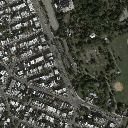 | 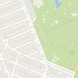 | 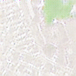 | 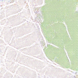 | 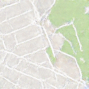 | 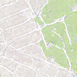 | 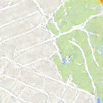 |
| 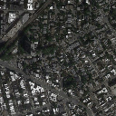 | 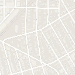 | 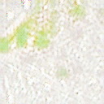 | 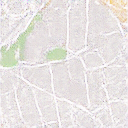 | 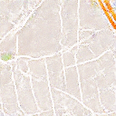 | 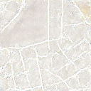 | 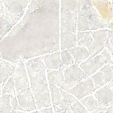 |

### SamGAN
| real satellite image | real maps image                                          | 5th epoch | 50th epoch                                    | 100th epoch                                    | 150th epoch                                    | 200th epoch                                    | 
|----------------------|----------------------------------------------------------|-----------|-----------------------------------------------|------------------------------------------------|------------------------------------------------|------------------------------------------------|
| 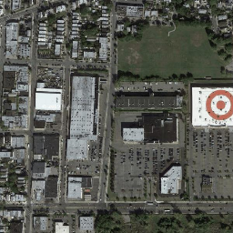 | 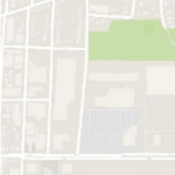 |  | 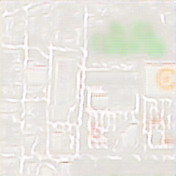 | 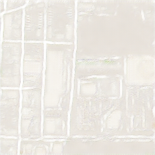 | 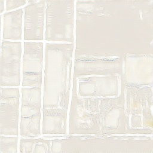 | 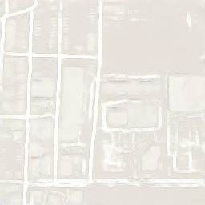 |
|  | 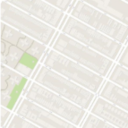 | 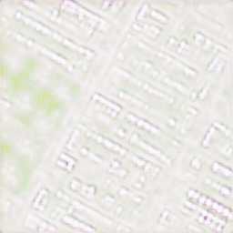 | 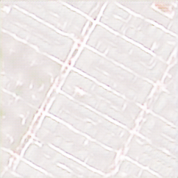 | 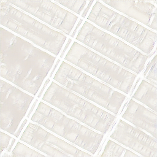 | 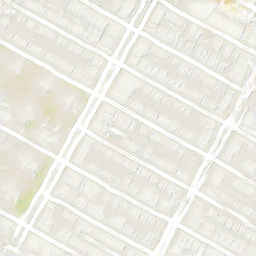 | 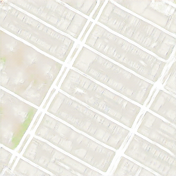 |

### pix2pix
| real satellite image | real maps image                                          | 5th epoch | 50th epoch                                    | 100th epoch                                    | 150th epoch                                    | 200th epoch                                    | 
|----------------------|----------------------------------------------------------|-----------|-----------------------------------------------|------------------------------------------------|------------------------------------------------|------------------------------------------------|
| 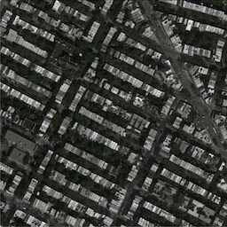 | 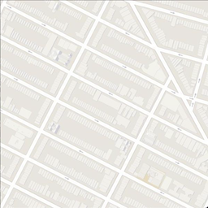 | 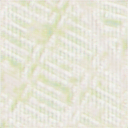 | 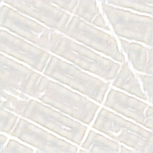 | 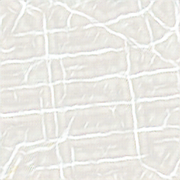 | 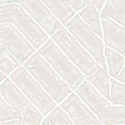 | 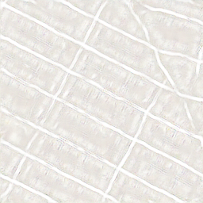 |
| 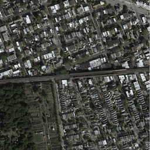 | 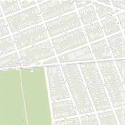 | 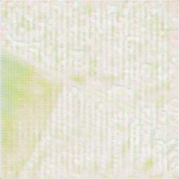 | 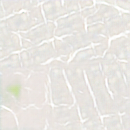 | 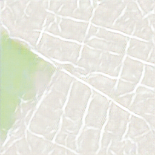 | 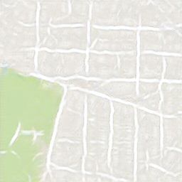 | 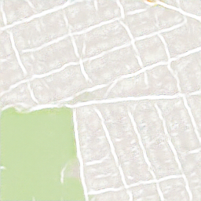 |

## Dataset
The dataset used in this project consists of satellite images and their corresponding maps. The data was sourced from https://www.kaggle.com/datasets/vikramtiwari/pix2pix-dataset, which provides high-resolution (1200x1200) satellite imagery and accurately annotated maps. The dataset is organized into training and validation sets.

## Inspiration

We were inspired by https://arxiv.org/pdf/1703.10593

