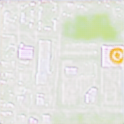
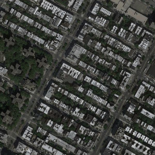

# satellite-image-mapper-3000

## Results

### CycleGAN
| real satellite image | real maps image                                          | 5th epoch | 50th epoch                                    | 100th epoch                                    | 150th epoch                                    | 200th epoch                                    | 
|----------------------|----------------------------------------------------------|-----------|-----------------------------------------------|------------------------------------------------|------------------------------------------------|------------------------------------------------|
|  |  |  |  |  |  |  |
|  |  |  |  |  |  |  |

### SamGAN
| real satellite image | real maps image                                          | 5th epoch | 50th epoch                                    | 100th epoch                                    | 150th epoch                                    | 200th epoch                                    | 
|----------------------|----------------------------------------------------------|-----------|-----------------------------------------------|------------------------------------------------|------------------------------------------------|------------------------------------------------|
|  |  |  |  |  |  |  |
|  |  |  |  |  |  |  |

